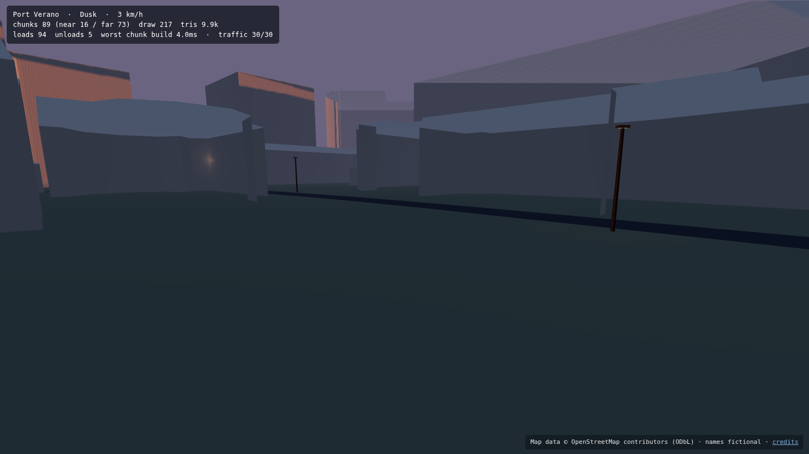
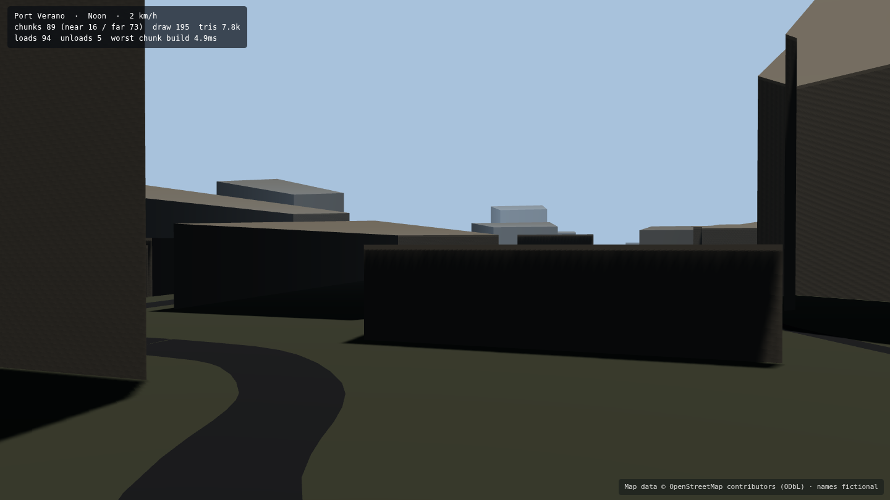
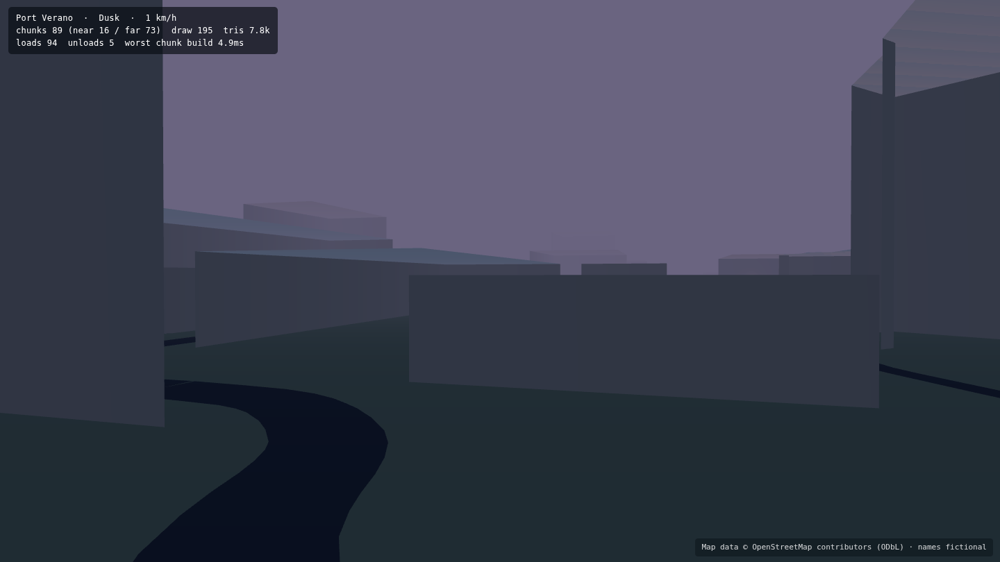
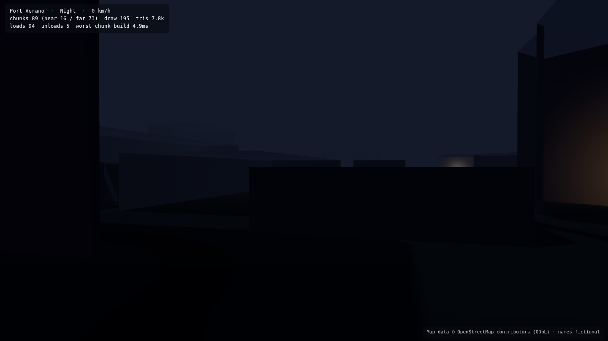

# Phase 1b — Data Bake, Streaming & Churn Probe

**Project:** open-world crime-action vertical slice, Three.js, fully static, procedural
assets, GitHub Pages deployable. District modelled on real downtown Sarasota geometry;
all identity fictionalized as **Port Verano**.
**Probe date:** 2026-08-29 · **Time-boxed:** ~75 min (ran ~95)

**Bottom line:** real map data works, and it is *cheaper* than the invented city I
budgeted for in Phase 1 — the bake is 294 KB and the whole 1.44 km² district streams at
**145 draw calls p95 with 64% headroom** against the budget gate, traffic included. The
draw-call ceiling I called Risk 1 in Phase 1 is not the binding constraint at this
density; **content detail is**, because these buildings are untextured extrusions. The
two genuinely new risks are **9.9% height-tag coverage** (90% of the massing is invented
anyway) and **a 6.6 ms synchronous chunk-build stall** that will grow with detail.

**One correction to the brief:** the draw-call budget gate and golden-trace gate did
**not** exist. Phase 1 *recommended* them; `tools/` held only `physics-test.mjs` and
`probe.mjs`. Both are now built (`tools/budget.mjs`, `tools/golden-trace.mjs`) and every
number below is asserted against them.

**Reproduce:** `npm run serve`, then `npm run bake:local` · `npm run test:golden` ·
`npm run drive` · `npm run drive:traffic` · `npm run sweep`.

---

## 1. OSM bake

Overpass was unreachable through this container's proxy (repeated 503s and mid-exchange
tunnel resets across four mirrors). Fell back to the canonical OSM API bbox endpoint,
which is a better source anyway: `api.openstreetmap.org/api/0.6/map`.

The requested bbox covered **3.96 km²** — too large. Trimmed to **1.437 km²**
(1434 × 1002 m), keeping the bayfront/marina edge on the west and the full downtown
Main Street corridor through Five Points.

| | |
|---|---|
| Raw extract | **6.26 MB** XML (23,493 nodes / 3,467 ways / 100 relations) |
| Baked JSON | **293.9 KB** — a **21.8×** reduction |
| District area | 1.437 km² |
| Road graph | 2,159 vertices, **935 edges**, 385 one-way, 516 named |
| Building footprints | **523** |
| Land-use / leisure zones | 271 |
| Water | 2 polygons + 4 coastline ways (350 points) |
| Chunks (128 m) | 113 |
| Streets renamed | 98 |

### Height-tag coverage — the headline data finding

| | Count | Share |
|---|---:|---:|
| `height` tagged | 38 | 7.3% |
| `building:levels` tagged | 14 | 2.7% |
| **Defaulted by us** | **471** | **90.1%** |
| **Real (either tag)** | **52** | **9.9%** |

Bayfront specifically (within 250 m of the real coastline): **153 footprints, 12.4% real.**
Slightly better than the district average — the bayfront towers are more likely to be
surveyed — but still ~7 in 8 invented.

Defaulting is by footprint area, banded and then adjusted by land-use zone, with bayfront
parcels over 700 m² floored at 12 storeys. Every defaulted building carries `d: 1` in the
JSON so an art pass can always tell real massing from invented.

**What this means:** "footprints and massing come from real data" is only half true. The
*footprints* are real and that is the valuable part — the block structure, the setbacks,
the irregular parcel shapes that make a real downtown read as real. The *massing* is 90%
ours. Budget for height authoring as real work, not as a data import.

### Naming
Geometry real, identity invented. City **Port Verano** on **Verano Bay**; Main Street
becomes **Marlin Street**, Gulfstream → Halyard, Pineapple → Tarpon Row, Lemon → Lantern,
and so on across 98 streets. The mapping is emitted to `district.json` under
`streetNames`, so keeping real names later is a one-line change.

### Attribution
`© OpenStreetMap contributors`, ODbL 1.0, is in the [README](README.md), in the in-game
[credits screen](district/credits.html), and in the district page's on-screen attribution
line. OSM is touched **only at author time** (`tools/bake/`); the game loads the committed
`data/district.json` and fetches nothing. **No Google Maps or Street View data or imagery
is used anywhere in this project**, including as critic references.

---

## 2. Streaming skeleton on real data

`src/streaming.js`. 128 m chunks, features pre-assigned to chunks at bake time so the
runtime never scans the district. Two LODs, a per-frame build budget, and a road graph
whose edges are registered in **every** chunk they cross — so a street spanning a
boundary renders continuously from both sides rather than popping at the seam.

| LOD | Radius | Geometry | Shadows |
|---|---|---|---|
| **NEAR** | ≤ 2 chunks | Full footprint extrusion (walls + ear-clipped roof) | cast + receive |
| **FAR** | ≤ 5 chunks | Footprint bounding box — same silhouette, a fraction of the vertices | none |

**The draw-call decision that matters:** every building in a chunk is merged into **one**
BufferGeometry per LOD. A loaded chunk costs **2 draw calls** (buildings + roads), not
one per building. 89 chunks resident = 89 chunks × ~2, and measured p95 is 145 — against
Phase 1's 568 calls for a *single* street corner.

It implements the Phase 1 `ground.js` interface (`heightAt` / `raycastDown`) unchanged,
so **the Phase 1 `Vehicle` class drives on the streamed district with zero modifications**
— the golden-trace gate still passes on the same committed trace. Downtown Sarasota is
essentially flat, so a constant ground plane is honest here; the interface is what
matters, and terrain can become a heightfield later without the vehicle noticing.

The water boundary is a single plane 45 cm below ground level, per the brief — a cheap
world edge, not a feature.

---

## 3. Scripted drive-through

`tools/drive-through.mjs`. Autopilot drives the 9-waypoint route — marina → east along
the Marlin Street corridor → Five Points → east → north → back west on 2nd Street →
bayfront — snapped to real road vertices (worst snap 59 m at the marina, which sits off
the road network; every other waypoint within 22 m).

**Frame rate is not reported.** This container renders through SwiftShader at ~5 fps.
Every metric below is either per-frame-independent or measured against **simulated**
time. To cover 2.6 km × 3 circuits under software rendering, the harness advances sim
and streaming 22× per rendered frame; draw calls are still counted per real rendered
frame, and all rates use simulated seconds as the denominator.

### Results — 3 full circuits each

| Metric | No traffic | +30 stub vehicles |
|---|---|---|
| Circuits completed | 3 | 3 |
| Distance driven | 7,604 m | 7,674 m |
| Simulated duration | 221.8 s | 225.1 s |
| **Draw calls** min/p50/**p95**/max | 28 / 54 / **141** / 158 | 28 / 54 / **145** / 157 |
| Triangles p95 | 7,959 | 8,416 |
| Chunks resident p50/max | 68 / 89 | 68 / 89 |
| LOD near / far (p50) | 16 / 53 | 16 / 53 |
| **Chunk loads / unloads** | 302 / 312 | 308 / 313 |
| **Loads per simulated second** | **1.36** | **1.37** |
| Unloads per simulated second | 1.41 | 1.39 |
| LOD swaps | 552 | 552 |
| **Worst chunk-build stall** | **4.8 ms** | **6.6 ms** |
| Heap before → after | 12 → 11 MB | 12 → 10 MB |
| **Heap growth over 3 circuits** | **−1 MB** | **−2 MB** |
| Speed p50 / max | 125 / 144 km/h | 125 / 144 km/h |

### Budget gate

```
BUDGET GATE: PASS          (with 30 stub vehicles)
  PASS draw calls            145   warn 260   fail 400   headroom 63.7%
  PASS triangles            8416   warn 900k  fail 1.8M  headroom 99.5%
  PASS chunk stall ms        6.6   warn 8     fail 16    headroom 58.8%
  PASS heap growth MB         -2   warn 40    fail 120   headroom 101.7%
```

**Headroom: 64% on draw calls, 59% on chunk stall.** Those are the two that matter;
triangles are irrelevant at 0.5% of budget, exactly as Phase 1 predicted.

**Three honest caveats.**
1. The autopilot drives at **125 km/h median** — absurd for a downtown grid. That makes
   the churn numbers *conservative*: real city speeds would cross boundaries far less
   often. 1.36 loads/s is close to a worst case, not a typical one.
2. Buildings are **untextured flat-shaded extrusions**. Real materials add texture binds
   and likely a second draw call per chunk. The 64% headroom is against placeholder
   content and will shrink.
3. Unloads exceed loads by ~10 over the run — that is the route ending in a different
   chunk than it started, not a leak. Heap growth of −1/−2 MB across three circuits
   confirms no leak.


*Mid-route on the streamed district with 30 stub vehicles.*

### Bugs this step caught
Two real ones, both invisible without the harness:
- **Autopilot steering sign inverted.** Positive steer yaws right, but the correction was
  applied as `-err`, so the car turned *away* from every waypoint and drove into the bay.
  It surfaced as draw calls collapsing to 11 and chunk loads frozen at 0 — the car was in
  empty water with nothing to stream.
- **Wall-clock-bound simulation.** At 5 fps software rendering, three circuits would have
  taken ~48 minutes. Fixed with harness time-scaling plus reporting rates against
  simulated time.

---

## 4. Churn + traffic stub

`src/traffic.js`. 30 kinematic vehicles following the **real** baked road graph, obeying
its one-way flags via a directed adjacency map (o = 1 forward, −1 reversed, 0 both), with
no U-turns. No AI: no following distance, no signals, no avoidance — this is a streaming
churn test, not a driving test. The whole fleet is **one `InstancedMesh` = 1 draw call**.

| | |
|---|---|
| Fleet | 30 |
| Alive at end | 30 |
| Spawns | 477 |
| Despawns | 413 |
| Dead-end recycles | 34 |
| **Orphaned vehicles** | **0** |
| Max simultaneous orphans | 0 |
| Worst orphan duration | 0 s |
| Overlapping-pair frames | 1,745 / 4,928 (**35.4%**) |
| Draw calls added | **1** |
| Draw-call cost vs. no traffic | +4 (p95 141 → 145) |

**Spawn/despawn policy.** Spawn on a road edge 90–340 m from the player — inside the
streamed ring but outside immediate view, so cars are never seen materialising. Despawn
beyond 420 m. Dead-ends (one-way traps in the real graph) recycle the vehicle.

**The books balance exactly:** 413 despawned + 34 dead-ended + 30 still alive = **477 =
total spawns.** No leaked, duplicated, or lost vehicles across 3 circuits.

**Orphans: zero, by construction.** The 420 m despawn radius sits *inside* the 640 m far-LOD
ring, so a vehicle is never simulated in a chunk that is not resident. I verified this
against the streamer's actual residency map rather than a distance guess — traffic asks
`world.loaded.has(world.keyOf(x, z))`.

**Overlaps at 35.4% of frames are expected and are the baseline to beat.** With no
collision, following distance, or intersection logic, 30 cars on a 935-edge graph will
routinely occupy the same space. This is the number the real traffic system has to drive
toward zero, and it is now measured rather than assumed.

**A metric bug I found and fixed mid-probe:** my first orphan counter reported **34,864**
orphans. It was tallying *frames × cars beyond a distance threshold*, not distinct
orphaned vehicles — a meaningless number that would have looked alarming in this report.
Rewritten to count distinct cars whose chunk is genuinely not resident, plus max
simultaneous and worst duration.

---

## 5. Day/night lighting sweep

`tools/daynight-sweep.mjs`, `src/daynight.js`. Same camera on the Marlin Street corridor
for all three. **Intensities are real photometric units** — directional and hemisphere in
**lux**, point lights in **candela** — and exposure moves with the light level the way a
camera's auto-exposure does, so "looks right" and "is physically sane" stop competing.

| | Noon | Dusk | Night |
|---|---|---|---|
| Sun (lux) | 100,000 | 1,200 | 0.6 |
| Sky / hemisphere (lux) | 20,000 | 900 | 3.5 |
| Street lamps lit | 0 | 233 | 233 |
| Lamp intensity (candela) | — | 900 | 900 |
| Exposure | 1/78,000 | 1/330 | 1/2 |
| Tone mapping | ACESFilmic | ACESFilmic | ACESFilmic |
| Lights in graph | 235 | 235 | 235 |
| Shadow casters / receivers | 64 / 110 | 64 / 110 | 64 / 110 |
| Draw calls | 195 | 195 | 195 |
| **Implausible flags** | **none** | **none** | **none** |




*Noon, dusk, night — identical camera on the Marlin Street corridor.*

### The plausibility check, and proof that it works

Each preset is asserted against a photometric envelope (`PLAUSIBLE` in `src/daynight.js`):
noon sun 50–130 klx, dusk 200–4,000 lx, night 0–3 lx; street lamps 300–3,000 cd; and lamps
must be off at noon. All three presets pass.

**A checker that has never failed is not a check.** So the sweep ends with a negative
test that re-injects the exact Phase 1 mis-tuning — street lamps at **26 cd** — and
confirms it is caught:

```
=== NEGATIVE TEST: Phase 1 mis-tuning (lamps at 26 cd) ===
CAUGHT: point light 26 cd outside plausible 300-3000     (233 lights flagged)
```

This is the Phase 1 incident closed out. A blind critic priced that mis-tuned constant as
3–4 engineer-weeks of missing "clustered lighting"; the gate now catches it in
milliseconds, at author time, before anyone looks at a frame.

### What the sweep exposed anyway
The first night capture had **no visible lamp pools** — the Phase 1 symptom exactly. But
the audit said 233 lamps at 900 cd were lit, so it could not be an intensity bug. It was
**coverage**: lamps were only placed on the top-ranked arterials (41 posts), and the
corridor camera saw none of them. Widened the placement filter and the pools appear.

Same class of error, opposite cause — and the audit is the only reason the five minutes
went into placement instead of into rebuilding a lighting system that was already there.
**Pair every visual capture with a scene-graph audit** is now proven twice over.

### Remaining gaps at night
The night frame is still sparse: 233 lamps across 1.44 km² is roughly a tenth of real
street-lighting density, buildings have no lit windows (Phase 1's facade system is not
wired into the streamed LOD yet), and there is no bloom, so emitters do not read as
bright. All three are Phase 2 line items, not blockers.

---

## 6. Revised Phase 2 estimate

Phase 1 estimated **~275 h good case / ~415 h realistic**. Measured revisions:

| Line item | Phase 1 | Now | Confidence | Why it moved |
|---|---:|---:|---|---|
| **World streaming, city layout, road graph, LOD** | 32 | **20** | **High** | Largest single reduction. The hard parts — chunking, LOD, boundary-spanning roads, load/unload, budget — are built and measured. Real data removed the entire "invent a plausible city layout" problem. Remaining: heightfield terrain, occlusion culling, interiors. |
| **City layout / procedural generation** | (in the 32) | **−** | — | Deleted as a line item. The layout is a 294 KB file. This is the biggest structural win of Phase 1b. |
| Data bake pipeline + height authoring | 0 | **+14** | **Medium** | New line item. The bake is done (~4 h); the other 10 h is authoring massing for the 90% of buildings with no height tag, plus zone-aware kit selection. |
| **Traffic + pedestrian AI** | 24 | **26** | **Low→Medium** | Graph traversal, one-ways, spawn/despawn and instancing are done and cost ~1 draw call. But the 35.4% overlap rate is the whole remaining problem: following distance, intersections, signals, right-of-way. Slight increase because the real graph has 34 one-way dead-end traps per 3 circuits that a real system must route around, not teleport out of. |
| **Day/night, weather, atmosphere** | 12 | **8** | **High** | Physical-unit system, three presets, audit and plausibility gate all built. Remaining: continuous interpolation, sun position from date/time, rain. |
| Post-processing (HDR, bloom, SSAO, TAA) | 14 | 14 | Low | Untouched. |
| Everything else (vehicle, controller, characters, audio, missions, HUD, perf, integration) | 193 | 193 | unchanged | Untouched by this probe. |
| **Subtotal** | 276 | **275** | | |
| Uncertainty ×1.5 | ~415 | **~410** | | |

**The total barely moved, but its shape changed and its confidence went up.** Streaming
and city layout — 32 h at low confidence in Phase 1 — are now 20 h at high confidence with
a working implementation behind them. That reduction was almost exactly consumed by a new
14 h height-authoring line that the real data revealed. **Net: a wash on hours, a
significant reduction in variance.** The remaining low-confidence mass is concentrated in
traffic AI and post-processing.

### Updated ordered cut list

Reordered by what the measurements now say. Cut from the bottom up.

1. **Weather beyond rain + fog** — unchanged from Phase 1.
2. **Pedestrians** — traffic proved graph-following is cheap, but pedestrians need
   sidewalk topology OSM does not reliably provide here, plus a second animation set.
   Highest cost-to-visible-value ratio in the project.
3. **Building interiors / enterable spaces** — never in scope, worth naming as cut.
4. **Full district height authoring** — author massing along the mission route and the
   Marlin Street corridor only; leave outlying blocks on defaulted heights. The data says
   90% are invented anyway, so invent them *cheaply* where the camera never goes.
5. **Second LOD tier + occlusion culling** — 64% draw-call headroom means this is not
   needed yet. Revisit only if textured materials eat the margin.
6. **TAA** — expensive to plumb (motion vectors); aliasing is real but survivable.
7. *(Do not cut)* **Bloom + height fog** — cheapest visual-quality-per-hour in the
   project, and the critic ranked both above almost everything else.
8. *(Do not cut)* **The two gates** — draw-call budget and golden trace. They have already
   caught four real defects across two probes.

### Changes to the spec I now recommend, on top of Phase 1's list

**8. Treat "building massing from real data" as false, and plan for it.** — *new.*
Only 9.9% of footprints carry a height. The footprints are the valuable import; the
massing is authoring work either way. This does not change the decision to use real data
— the block structure is worth it on its own — but it should not be budgeted as free.

**9. Keep the district at ~1.4 km².** — *confirms Phase 1's recommendation.* At this size
the whole district is 294 KB and streams with 64% headroom. Phase 1 recommended shrinking
the footprint on the *guess* that draw calls would bind; the measurement supports the same
call for a different reason — there is now room to spend the headroom on **detail**
rather than on **area**.

**10. Raise the draw-call budget's warn threshold once materials land.** — *new.* The
current 260/400 thresholds were set against untextured extrusions. They should be
re-derived after the first textured chunk, or the gate will fire on the first real
material and get ignored — which is how budget gates die.

---

## Appendix — artifacts

| File | What |
|---|---|
| `data/district.json` | The baked district (294 KB) |
| `data/bake-report.json` | Bake statistics |
| `data/golden-trace.json` | Committed handling trace |
| `docs/drive.json` / `docs/drive-traffic.json` | Per-frame drive-through samples + gate results |
| `docs/daynight.json` / `docs/daynight-negative.json` | Sweep audits + negative-test result |
| `tools/bake/` | Author-time OSM fetch + bake (never runs in the browser) |
| `tools/budget.mjs` | Draw-call / stall / heap budget gate |
| `tools/golden-trace.mjs` | Vehicle-handling regression gate |
