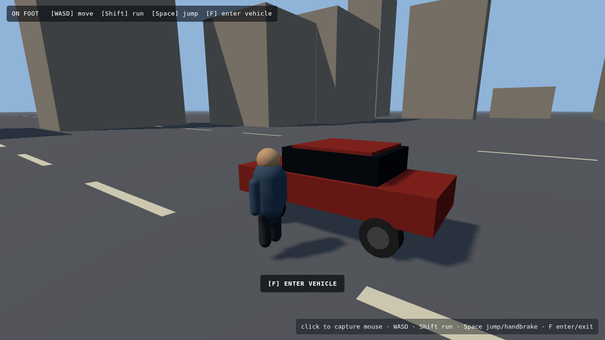
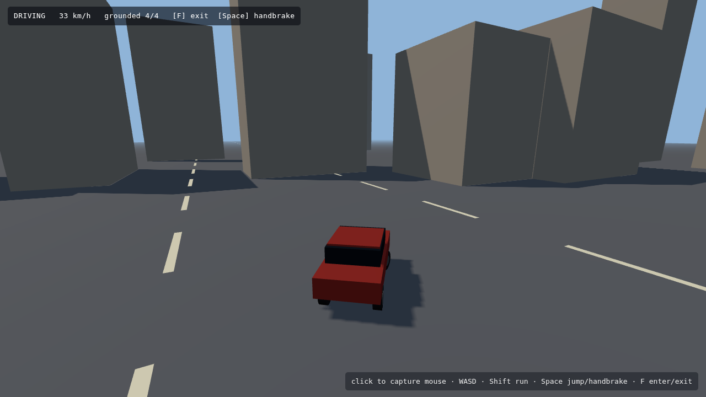
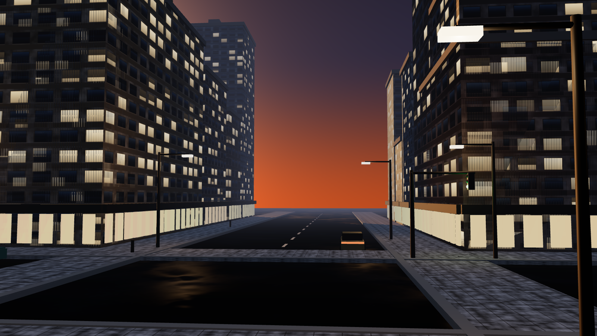
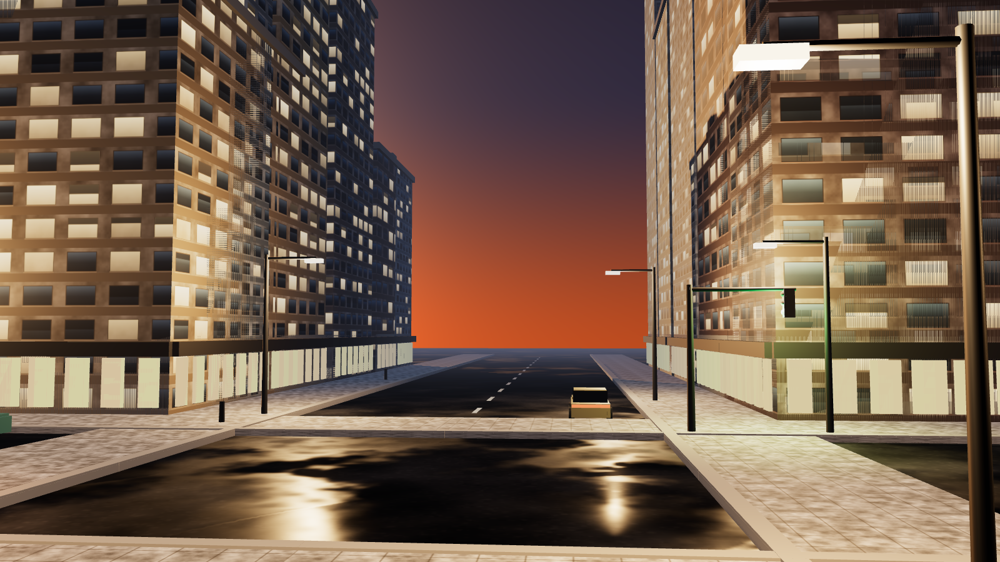

# Phase 1 — Feasibility Probe

**Project:** open-world third-person crime-action vertical slice, Three.js, fully static,
100% procedurally generated assets, GitHub Pages deployable.
**Probe date:** 2026-08-29 · **Time-boxed:** ~45 min

**Bottom line:** the coupled core works and is not the risk. A blind critic scored the
visual sample **"below GTA V, above hobby placeholder"**, and independently reached the
same conclusion I did — the GTA VI trailer bar is not reachable in a browser, and the
spec should be retargeted to GTA V-on-PC. Three of the five risks below are confirmed
rather than hypothetical: I hit them during this probe. Estimated Phase 2 effort is
**~275–415 focused hours**. Section 5 lists what I think should be cut.

**Reproduce everything here:** `npm run serve`, then `npm run test:physics`
(deterministic vehicle rig, no browser) and `npm run probe` (drives the live page
through Playwright and writes the screenshots).

---

## 1. Decomposition plan

Legend: **SEQ** = one sequential owner, **PAR** = safe to hand to a parallel builder.

The rule I used: a piece gets a parallel builder only if it can be defined by a
**pure interface with no shared mutable per-frame state**. Anything that reads or
writes the same physics/transform state inside a single frame goes sequential,
because two builders touching that state produce bugs that are indistinguishable
from each other's bugs at the seam.

| # | Piece | Mode | Why | Tightly coupled to |
|---|---|---|---|---|
| 1 | **Engine shell** — renderer, fixed-step scheduler, scene registry, event bus | **SEQ** | Everything else is downstream of its contracts. Must land before any parallel work starts. | Everything |
| 2 | **World streaming & city layout** | **SEQ** | *Mandated, and correct — see argument below.* | 3, 4, 10, render budget |
| 3 | **Vehicle physics** | **SEQ** | *Mandated, and correct.* Single mutable rigid-body state advanced in-order each substep. | 2, 4, 5, 10, 11 |
| 4 | **Player controller** | **SEQ** | *Mandated, and correct.* | 2, 3, 5, 8, 12 |
| 5 | **Camera rig** | **SEQ — same owner as #4** | Camera is not a separate concern: "feel" is a joint property of controller + camera + input. Splitting it across two people produces two half-tunings. | 3, 4 |
| 6 | **Procedural material/texture library** | **PAR** | Pure functions `params → CanvasTexture`. Zero shared state. Highest parallel value. | naming contract only |
| 7 | **Building kit-of-parts generator** | **PAR** | Pure `params → BufferGeometry`, consumed by #2 through an interface. | 2 (interface), 6 |
| 8 | **Character meshes + skinning/animation clips** | **PAR** | Rig and clip *authoring* is pure data. | — |
| 8b | **Animation state machine** | **SEQ — same owner as #4** | Reads controller state every frame; a separate owner desyncs it from locomotion. | 4 |
| 9 | **Procedural audio** (engine, tyres, sirens, ambience, music) | **PAR** | WebAudio graph driven purely by events off the bus. | event bus |
| 10 | **Traffic & pedestrian AI** | **SEQ, starts after #2's road graph is stable** | Writes to many vehicle bodies per frame; sits directly on top of streaming *and* vehicle physics, the two riskiest systems. Can start early against a stubbed road graph. | 2, 3 |
| 11 | **Wanted / police response** | **PAR**, on top of #10 | State machine over events; touches no physics directly, only issues AI goals. | 10, event bus |
| 12 | **Mission scripting + triggers** | **PAR**, last | Declarative trigger/objective graph over the event bus. | 4, 11, event bus |
| 13 | **Sky, atmosphere, day/night, weather** | **PAR** | Owns its own lights and uniforms behind a `TimeOfDay` interface. | render budget |
| 14 | **HUD, minimap, menus** | **PAR** | DOM/canvas overlay, reads state, writes nothing. | — |
| 15 | **Post-processing stack** | **SEQ — same owner as #1** | Competes for the same frame budget as everything else; needs one person holding the budget. | 1, 13 |

### The mandate on #2/#3/#4 — I agree, and this probe produced the evidence

I was asked to argue if I disagreed. I don't. The probe itself demonstrated why:

The vehicle module contained a **scratch-vector aliasing bug** (`applyImpulseAt`
reused a temporary the caller was still holding, so `offset.cross(impulse)` became a
self-cross and evaluated to zero). Its only symptom was that **suspension torque was
silently always zero** — the car looked fine, drove forward, and reported four wheels
grounded. It surfaced only as second-order weirdness: a top speed of 221 km/h, a car
riding at 0.88 m, and two wheels off the ground under acceleration.

That is exactly the class of bug that becomes unfixable with parallel owners. If a
traffic-AI builder and a vehicle-physics builder had both been editing during that
window, the symptom ("cars look wrong at speed") points at neither of them. One owner,
one deterministic harness, one bisectable history.

The same argument holds for streaming (frame-budget ownership can't be split) and for
the player controller (feel is not decomposable).

---

## 2. Risk register

Ranked by expected damage. **Risks 1 and 3 are confirmed** — I hit them in this probe.

### Risk 1 — Draw-call ceiling, not triangle count *(CONFIRMED)*
One street corner already costs **568 draw calls / 633 geometries** for only 8,790
triangles. Triangles are a non-issue; **submission cost is the wall**. A dense district
is 50–100× this corner. At ~2,000 draw calls most browsers fall off 60 fps regardless
of GPU.
**Mitigation:** make instancing structural, not an optimisation pass. Buildings become
`InstancedMesh` per kit-part; street furniture becomes one instanced buffer per prop
type; facades share one texture atlas so blocks can be merged into a single geometry
per city block. Add a **hard CI gate** that fails the build if a representative camera
exceeds a draw-call budget. Do this *before* content volume grows, because retrofitting
instancing into authored content is a rewrite.

### Risk 2 — The procedural quality plateau
Procedural generation reaches "convincingly game-like" fast and then stalls well short
of "art-directed". The gap is *intentional irregularity* — the weathering, signage,
asymmetry and hand-placed hero detail that reads as authored. Pure noise does not
produce it, and more noise makes it worse.
**Mitigation:** kit-of-parts with **hand-authored parameter sets** (a human picks the
20 facade recipes; code instances them), plus a small number of hand-placed hero
landmarks along the mission route. Budget an explicit art-direction pass as a named
deliverable, not as leftover time.

### Risk 3 — Physics/controller rot under a variable timestep *(CONFIRMED)*
Measured with a variable frame-time step, the identical input sequence over 8 s of
cornering diverged from **z = 174 m at 30 Hz to z = 13 m at 120 Hz**. Frame rate was
silently changing vehicle handling. Two further frame-rate dependencies were found in
the same module (a per-frame steering lerp; per-frame tuning constants).
**Mitigation:** already implemented — `Vehicle.stepFixed()` runs a 120 Hz accumulator
regardless of render rate. Post-fix, 15 Hz and 144 Hz agree to **1.6 m over 8 s**
(residual is the partial-step remainder). Plus: **golden-trace regression tests** in
CI — a fixed input script whose output positions are asserted, so any handling change
is deliberate.

### Risk 4 — No real GPU performance signal during development *(CONFIRMED — environmental)*
This container renders through SwiftShader (software). Measured **4.7 fps**, which says
nothing about real hardware. Building for months against a blind perf target is how a
project discovers on launch day that it needs a 40% cut.
**Mitigation:** treat *proxy metrics* as the gate — draw calls, triangles, texture
memory, active lights, shader-permutation count — all asserted in CI. Schedule explicit
**real-hardware checkpoints** at each milestone; nothing merges past a milestone without
one. Budget for a mid-project perf crisis rather than being surprised by it.

### Risk 5 — Four load-bearing systems that only fail together
Streaming, traffic, police response, and mission scripting each work in isolation and
interact badly at load: a police chase pushes 20 AI vehicles across a streaming boundary
while a mission trigger is live. This integration is where projects like this stall,
and it is always discovered late.
**Mitigation:** force the integration early — a "chase harness" scene that spawns the
worst case (max traffic + active pursuit + streaming churn) from week one, long before
the mission exists. Keep a **written cut list** ordered in advance (see §5) so that
descoping is a decision, not a panic.

### Risk 6 (added after the critic round) — mis-tuned parameters read as missing features
A blind visual critique confidently attributed a wrong light-intensity constant to an
entirely absent lighting subsystem, and priced the "fix" at 3–4 engineer-weeks. The real
fix was one number. In a project where visual review is the main quality signal, this
failure mode is expensive in both directions — it can send builders to rewrite working
systems, and it can hide genuine gaps behind plausible-sounding ones.
**Mitigation:** every visual critique is paired with a **scene-graph audit** (what is
actually enabled, how many lights, how many shadow casters, which materials) before any
work is scheduled off it. The audit for this probe took two minutes and overturned three
of the critic's six findings.

**Also watched, below the top five:** total payload on GitHub Pages (three.js is already
2.0 MB unminified, and no build step means no bundler); WebGL context loss on long
sessions; audio autoplay policy; and mobile/Safari WebGL2 divergence.

---

## 3. Walking skeleton — built and verified

`skeleton/` — a static page, no server, no build step. Character walks and runs,
approaches a car, presses **F** to enter, drives with real suspension and tyre
friction, handbrakes, exits.

**Modules** (`src/`): `input.js` · `player.js` (kinematic capsule) · `vehicle.js`
(raycast vehicle, no physics library) · `camera.js` (spring-arm chase cam) ·
`ground.js` (the interface the streaming world will implement).

*On foot: camera-relative movement, procedural walk cycle, contextual enter prompt.*

*Driving: 33 km/h, 4/4 wheels in contact, camera auto-aligning behind the car.*

### Verification — deterministic, headless, no human at the keyboard

`tools/probe.mjs` drives the real page through Playwright (walk → enter → accelerate →
corner → brake → exit). `tools/physics-test.mjs` steps the **same** `Vehicle` class at
a fixed 60 Hz with no renderer, so the numbers do not depend on frame rate.

| Measurement | Result | Read |
|---|---|---|
| 0 → 100 km/h | ~8.5 s (112.6 km/h at 10 s) | plausible street car |
| Top speed | 129 km/h | plausible |
| Braking, 112 km/h → 27 km/h | 2.0 s (≈1.2 g) | plausible |
| Steady cornering | 17.6 m radius @ 32 km/h, 0.4° body roll | plausible |
| Ride height under power | 0.717 m, 4/4 wheels grounded | stable |
| 30 s of adversarial random input | no NaN, quaternion normalised, car on its wheels | stable |
| Fixed-step determinism, 15 Hz vs 144 Hz | agree within 1.6 m over 8 s | **fixed** |
| Cost per vehicle substep | 2.29 µs | ~60 cars at 120 Hz ≈ 0.27 ms/frame |

**Verdict: the coupled core is not a project risk.** Controller, vehicle, camera and
input integrate cleanly, and vehicle CPU cost leaves ample headroom for dense traffic.
The risk in this project is entirely in **content volume and draw-call submission**,
not in the simulation.

---

## 4. Visual bar check

`visual/` — one street corner at dusk after rain. Every pixel is generated in code:
asphalt, wet-roughness maps, sidewalk concrete, facade window grids and their matching
emissive masks are all drawn into `<canvas>` at runtime. No image files, no downloads.
ACES filmic tone mapping, a procedural sky doubling as the IBL environment map,
shadow-casting sun, and per-lamp point lights.

**Cost:** 568 draw calls · 8,790 triangles · 14 textures · 633 geometries.
The draw-call figure is the headline number, and it is Risk 1 — 568 calls for *one
corner*, at a trivial 8.8 k triangles.

**A second finding, found by profiling and then fixed.** Generating one 1024 px facade
plus its emissive mask cost **2,219 ms**: the mask was derived by reading back a million
pixels with `getImageData` and scanning them in JavaScript. At 20 facade variants that
is ~44 s of startup before anything renders. Rewriting it to draw albedo and emissive in
a single pass brought it to **143 ms** — a 15× reduction, and the emissive mask can no
longer drift out of sync with the albedo. This is worth recording as a pattern: with
100% procedural assets, **texture generation is a startup-time budget that has to be
profiled like any other**, and the naive readback approach is a trap.

### Blind critic verdict

A fresh-context agent was given **only the image** — no code, no engine, no origin — and
asked to judge it against GTA VI trailer footage and GTA V on PC. It anchored its
comparison to the Trailer 1 night tracking shot down the neon hotel strip and to
Trailer 2's dusk skyline shot, and it verified its impressions with pixel measurements
rather than eyeballing.

> ### Verdict: **"Below GTA V, above hobby placeholder."**

> **Largest gap named:** *"Light sources are emissive geometry only. There is no punctual
> light accumulation pass — nothing in this scene emits radiance onto anything else."*
> It backed this by sampling sidewalk luminance in 20 px steps directly beneath two lamp
> posts and finding it flat (43–59, consistent with albedo noise), with **zero pooling**
> under either lamp — "a 250-nit emitter that leaves the surface next to it completely
> unlit." Its argument for why this outranks everything: in a night city scene the local
> lights *are* the image, and without them "you do not have a night scene; you have a
> daytime ambient render that has been dimmed."

**Next five gaps, in its priority order:** no shadow casting (sun or local); no
atmospheric scattering, leaving a razor-sharp world edge and no aerial perspective;
purely Lambert materials with no specular or reflections; no HDR pipeline (no tonemap,
no bloom, 11.2% of the frame crushed at luminance ≤ 4, visible sky banding); and
near-zero scene density with an untextured box for a vehicle. Just below the cut: edge
and texture aliasing that "will crawl violently in motion."

**What it said already works:** the colour script ("a real complementary dusk palette…
the colour decision itself is a professional one"), the facade window treatment
("the closest to shippable… does not read as an obvious tile"), and the camera and
street proportions ("this frame is *composed*, not just captured… the one thing you
cannot buy with engineer-weeks").

**Effort read:** ~30–40 engineer-weeks for a team of four to bring *one frame* to GTA V
parity; the actual GTA V bar, 250–500+ engineer-weeks. On GTA VI in a browser its answer
was a flat **no** — not because the browser is slow (it notes WebGPU makes the GTA V-class
feature set entirely practical today) but for structural reasons: no hardware ray tracing
exposed to the web, GPU memory ceilings, and the download bandwidth a city at that asset
density would require.

### Where the critic was wrong — and what testing it revealed

Three of its six findings assert that features are **absent** which are in fact present
and enabled. I audited the live scene graph rather than take either side on faith:

| Critic's claim | Audited reality |
|---|---|
| "No punctual light accumulation pass" | **10 `PointLight`s** in the scene |
| "No shadow casting of any kind" | Shadow maps **enabled**, 2048², **478 casters / 162 receivers** |
| "Purely Lambert materials — no specular, no reflections" | **1,707 PBR (GGX) materials**, 1,266 metallic, **PMREM env map** from the procedural sky |
| "No HDR pipeline — no tonemap" | **ACES filmic** tone mapping, exposure 1.35 |

So the critic's *observations* were accurate and its *measurements* were real — no light
was landing on that sidewalk — but its *diagnosis* was wrong. The features existed and
were mis-tuned. The street lamps were set to intensity 26 with decay 2; three.js uses
physical light units, so at ~7.5 m that delivers essentially nothing.

I tested the hypothesis directly by multiplying point-light intensity by 20 at runtime
and re-rendering. Wet-asphalt specular pooling, lamp falloff across the sidewalk, and
warm spill onto the facades all appeared immediately — the exact phenomena the critic
had called structurally impossible. The fix is now applied to the scene:

*After: street lamps at correct physical intensity, hemisphere fill raised to
un-crush the shadows. Compare with the frame in the section above.*

**Why this matters more than the verdict does.** A blind critic reasoning only from
pixels will confidently attribute a mis-tuned parameter to a missing subsystem, and the
two have wildly different costs — one is a constant, the other is the 3–4 engineer-weeks
it priced "clustered/forward+ local lights" at. **The lesson for Phase 2 is to pair every
blind visual critique with a scene-graph audit before acting on it**, or the project will
spend weeks rebuilding renderer features it already has.

The verdict itself I accept: **below GTA V, above hobby placeholder** is a fair reading
of the "before" frame. The remaining gaps it named that are genuinely absent — atmospheric
scattering and aerial perspective, bloom, SSAO, TAA, and above all **scene density** — are
real, correctly prioritised, and go straight into the Phase 2 plan. Its density point is
the one I would weight highest, and it agrees with Risk 1 from the opposite direction:
the frame needs far more objects, and the renderer currently spends 568 draw calls on
almost none.

---

## 5. Budget estimate and recommended spec changes

### What the probe actually cost

| Activity | Time |
|---|---|
| Repo setup, vendoring Three.js, static-serve harness | ~5 min |
| Walking skeleton — input, controller, vehicle, camera, ground, glue | ~15 min |
| Playwright probe harness + fixing module-loading | ~6 min |
| Deterministic physics rig, **finding and fixing 3 bugs**, tuning | ~12 min |
| Procedural texture library + street-corner scene | ~13 min |
| Two visual iterations (layout, shopfronts, framing, materials) | ~8 min |
| Texture-generation profiling + single-pass refactor | ~6 min |
| **Total** | **~65 min** |

The most informative number is the split: **writing** the vehicle took ~10 minutes,
**making it correct** took ~12 more, and it is still only a car on an infinite flat
plane. That ratio is the basis for everything below.

### Phase 2 estimate

Units are *focused engineering hours* — the probe's own unit. A small human team
(3 sequential owners + 3–4 parallel builders) maps this to roughly **7–10 calendar weeks**.

| Piece | Mode | Hours |
|---|---|---:|
| Engine shell, fixed-step scheduler, budget instrumentation | SEQ | 6 |
| **World streaming, city layout, road graph, LOD** | SEQ | 32 |
| Vehicle physics → shipped (collision, damage, gearbox, 3–4 vehicle classes) | SEQ | 20 |
| Player controller + animation state machine | SEQ | 18 |
| Skinned character meshes + procedural animation clips | PAR | 14 |
| Camera polish (geometry collision, aim mode, cinematic transitions) | SEQ | 6 |
| Building kit-of-parts + facade recipe library | PAR | 16 |
| Material / texture library at production breadth | PAR | 10 |
| Traffic + pedestrian AI | SEQ (after road graph) | 24 |
| Wanted / police response | PAR | 14 |
| Mission scripting + the one playable mission | PAR | 12 |
| Day/night, weather, atmosphere | PAR | 12 |
| Procedural audio (engine, tyres, sirens, ambience, music) | PAR | 14 |
| HUD, minimap, menus | PAR | 8 |
| Post-processing: HDR chain, bloom, SSAO, TAA | SEQ | 14 |
| Atmospherics the critic flagged as genuinely missing (height fog, aerial perspective) | PAR | 6 |
| **Performance work — instancing, atlasing, culling** | SEQ | 20 |
| Integration, tuning, bug-fix, art-direction pass | all | 30 |
| **Subtotal** | | **276** |
| Uncertainty allowance (×1.5, driven by Risks 1 and 5) | | **~415** |

**Estimate: ~275 h if things go well, ~415 h realistically.** Confidence is moderate
for the simulation half (I have measurements) and low for streaming and traffic
(I have none — nothing in this probe touched either).

### Changes I recommend to the project spec

**1. Retarget the visual bar from "GTA VI trailer" to "GTA V on PC." — recommended cut.**
This is the one spec change I would push hardest for, and the blind critic reached the
same conclusion independently from the image alone. The trailer's look rests on
offline-baked global illumination, virtualised geometry, volumetric atmospherics and a
deferred renderer with a full post stack — none of which are available at playable frame
rates in WebGL2 in a browser tab. GTA V-on-PC is a defensible, reachable target and is
still far above what browser open-world games typically look like. Keeping the GTA VI
wording in the spec guarantees the project is judged as a failure at the end no matter
how good it gets.

**2. Shrink the district footprint; spend the savings on density. — recommended change.**
"One dense, fully explorable district" is the right instinct, but *dense* and *large*
trade directly against Risk 1. A compact district with a genuinely dense hero corridor
reads far better in motion than a large sparse grid, and it is what the mission and the
chase actually use.

**3. Keep procedural audio. — no change.**
This is the cheapest procedural win in the project. WebAudio synthesis for engine notes,
tyre squeal, sirens and ambience is well-trodden and needs no art pipeline.

**4. Reduce weather to rain + fog. — recommended cut.**
Wet-surface materials are already carrying a large share of the visual quality in the
sample above, at almost no cost. Dynamic storms, snow and a full weather state machine
are a lot of work for a vertical slice that is set over a single evening.

**5. Add two CI gates that the spec does not currently ask for. — recommended addition.**
Given Risks 1 and 3, these are not optional: a **draw-call/triangle budget gate** that
fails the build when a representative camera exceeds budget, and **golden-trace physics
tests** that assert vehicle positions after a fixed input script. Both harnesses already
exist in `tools/`.

**6. Commit the minified Three.js build. — minor.**
The vendored unminified build is 2.0 MB of the 2.1 MB payload. Minified is ~0.7 MB.
The "no build step" constraint is about *our* code; the vendored library is just a file.

**7. Decide how procedurally generated textures are cached. — open question for you.**
Runtime generation currently costs ~143 ms per facade variant (down from 2,219 ms after
the single-pass refactor). Twenty variants is ~3 s of first-load work. Options: accept it
behind a loading screen; cache generated textures to IndexedDB after first run; or bake
at author time into committed files. The third is fastest but arguably violates
"generated procedurally in code from scratch" — I did not want to make that call for you.

### Anything I would not change

The **static / no-server / no-runtime-build** constraint cost essentially nothing. The
whole probe is plain ES modules served from disk, and it would deploy to GitHub Pages
as-is. The **all-original-branding** constraint likewise costs nothing, since every
asset is generated anyway.

