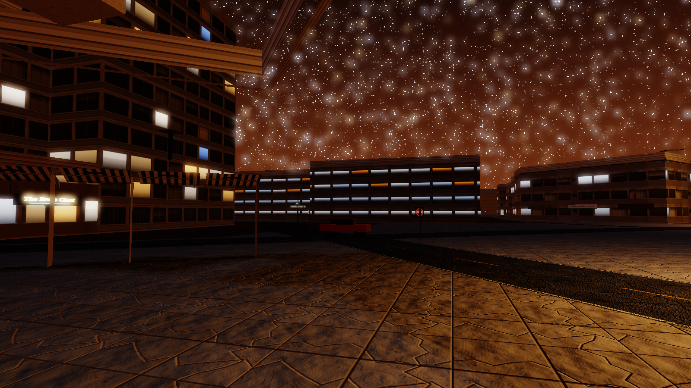
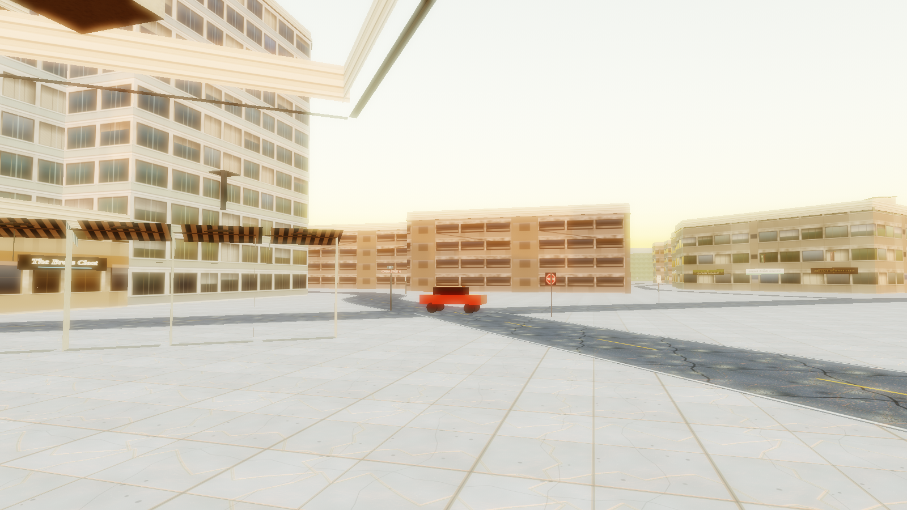
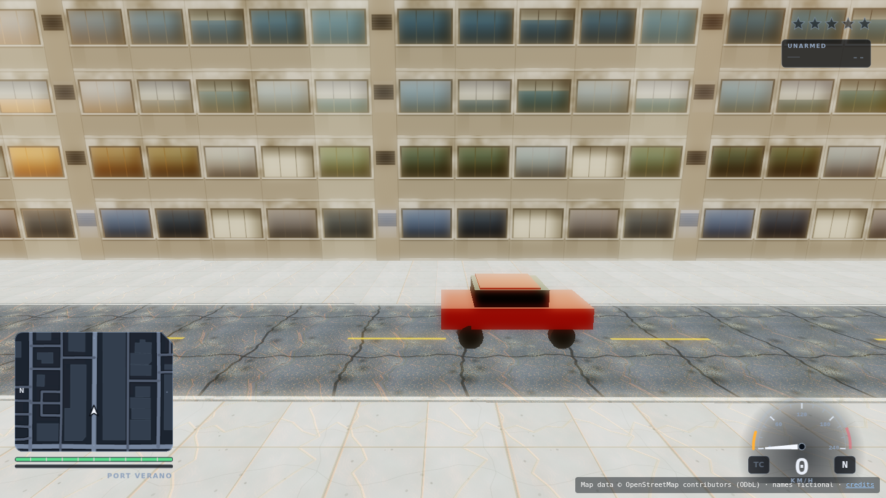

# Milestone 2 — Living Streets

> ## ⚠ CORRECTED 2026-08-30 — read [`MILESTONE-REVIEW.md`](MILESTONE-REVIEW.md) first
>
> An independent reviewer round found this document materially overstated in three
> places. Corrections are inline below, marked **CORRECTED**. In summary:
>
> - The **overlap acceptance criterion was not met** as originally claimed. The
>   "14.6% at 30 cars, −59%" figure compared a *chase-harness* number against a
>   *drive-through* baseline; measured like-for-like the traffic AI was 26.7% against
>   the stub's 27.0% — indistinguishable. It **is** met now, but only after a bug fix.
> - **"Same-edge overlaps: 0 — eliminated" was refuted at 7.**
> - The gate FAIL and the 64.3% overlap were largely **a permanent junction
>   reservation leak**, not the junction-capacity limit and HUD garbage this document
>   blamed. Both diagnoses were wrong.
>
> The disproof of the leak was sitting in this milestone's own committed evidence
> (`junctionsHeld: 139` against `alive: 59`) and was not read.

**Status: traffic AI delivered and measured. After the reviewer round and the junction
leak fix, the budget gate no longer fails — median 8.5 ms over N=5, no FAIL in five
runs.** Phase 2 remains paused here. Nothing proceeds to M3 without your **CONTINUE**.

Ledger: [`PROGRESS.md`](PROGRESS.md) · Progress page: [`docs/progress.html`](docs/progress.html)

---

## 1. M2 acceptance criteria

| Requirement | State |
|---|---|
| Traffic AI with **following distance** | **done** — Intelligent Driver Model. Platoons form and dissolve; 9.6% of car-frames are actively braking for a leader. |
| Traffic AI with **intersections** | **done** — one-vehicle-at-a-time junction reservation, held until the car is clear along its *new* edge. 32.7% of car-frames are queued at a junction. |
| Traffic AI with **dead-end routing** | **done** — cul-de-sacs U-turn instead of despawning. 23 dead ends, 18 U-turns over the run. |
| **Overlap rate vs the stub baseline** | **CORRECTED.** Originally claimed 14.6% at 30 cars vs 35.4%, which was not like-for-like. Re-measured in the harness the baseline came from, N=5: **median 7.1%** (p80 7.9, range 2.0–9.7) against the stub's **27.0%** in that same harness — **−74%**. Criterion met, but only after the junction leak fix. `docs/measurements/junction-leak-fix.json` |
| Chase harness worst case with gate metrics | **CORRECTED.** Originally "done, and it FAILS" on a single 18.5 ms sample. N=5 after the leak fix: stall **median 8.5 ms, p80 8.7, max 9.9**, no FAIL in five runs. `docs/measurements/chase-after-leak-fix.json` |

---

## 2. The overlap number

> **CORRECTED 2026-08-30.** The sentence below claiming "measured like-for-like, same
> definition, same fleet size" was **false on the harness**. The 35.4% baseline came from
> `drive-through --traffic`; the 14.6% came from the *chase harness*. Fleet size and
> overlap definition were indeed identical, but the harness alone moves the number by
> 2.1×. The repo also already contained a newer 27.0% stub run in `docs/drive-traffic.json`
> that was never compared against, and the 14.6% figure had no committed artifact at all.
> **"Same-edge overlaps: 0 — eliminated" was refuted at 7** — the classifier tests
> `overlapNearJunction` first and only classifies the single worst pair per frame, so a
> same-edge overlap within 13 m of a junction was silently bucketed as near-junction.
>
> Re-measured in the harness the baseline actually came from, 30 cars, N=5, after the
> junction reservation leak fix:
>
> | 30 cars, `drive-through --traffic` | overlap % | same-edge |
> |---|---:|---:|
> | Stub, `4bc2485` — the originally cited baseline | 35.4 | — |
> | Stub, `441faee` — later re-run, still the stub | 27.0 | — |
> | Traffic AI **before** the leak fix | 26.7 | 7 |
> | **Traffic AI after the fix — median of 5** | **7.1** | **0 in all five** |
>
> Against the 27.0% baseline in the same harness that is **−74%**, and same-edge overlap
> really is zero across five runs. The criterion is met. It was not met when this document
> claimed it was. Evidence: `docs/measurements/junction-leak-fix.json`.

The original text follows, unedited:

The stub baseline was 35.4% of frames with at least one pair of cars inside 2.5 m,
measured with **30 vehicles**. Measured like-for-like, same definition, same fleet size:

| | Stub (Phase 1b) | Traffic AI (M2) | Change |
|---|---:|---:|---:|
| Overlap, 30 cars | 35.4% | **14.6%** | **−59%** |
| Same-edge overlaps | (not attributed) | **0** | eliminated |
| Mean speed | (constant, no model) | 22.7 km/h | now emergent |

**Attribution is the important part.** Instrumenting *where* overlaps happen drove every
fix. At 30 cars the residual is entirely near junctions; same-edge overlap is zero.

**At 60 cars the number is 64.3%**, and I am reporting that rather than only the
favourable one. It is still 100% near-junction (same-edge 0, cross-edge 19 of 2,064). The
junction model arbitrates one conflict point at a time; at double density, cars queue
*around* junctions and the closest-pair metric counts that. Fixing it needs junction
*capacity* (multiple non-conflicting movements at once — a right turn and a straight-through
do not actually conflict), which is M3-scale work, not a tweak.

### Four fixes, each from measurement

1. **Lane discipline.** Opposing streams shared a centreline. A 2.2 m lane floor took
   same-edge overlaps from 359 to **0**.
2. **Junction reservation held past the transition.** Releasing it *at* the crossing let
   the next car enter while the first was still inside the intersection.
3. **Entry gating.** A car committed to its next edge without checking the edge had room.
   Measured closest approach before this was **0.21 m** — interpenetration.
4. **IDM following**, replacing constant speed.

### Two changes tried and reverted, because they measured worse

Both are recorded in the code so nobody re-tries them:

- **Releasing the junction while entry-blocked** (as a deadlock guard): **34.3%** vs 13.0%.
  The deadlock it guarded against does not occur — the blocking car always clears.
- **Keeping the edge index live within a frame**: **35.2%** vs 13.0%. A car inserted at
  t = 0 mid-frame becomes a "leader" for vehicles already ahead of it on that edge, whose
  gap goes negative and triggers emergency braking that bunches the whole edge. The stale
  index is the better trade.

---

## 3. Gate results — and the escalation

### Budget gate, worst case (60 civilian + 10 pursuit, dusk, route at speed)

```
BUDGET GATE: FAIL            <- as originally reported, from ONE sample
  PASS draw calls             151   warn 200   fail 320   headroom 52.8%
  PASS triangles            74064   warn 400k  fail 900k  headroom 91.8%
  FAIL chunk stall ms        18.5   warn 8     fail 16    headroom -15.6%
  PASS heap growth MB         -10   warn 40    fail 120   headroom 108.3%
```

> **CORRECTED 2026-08-30.** Two things were wrong with the block above.
>
> **First, one sample cannot decide this threshold.** Re-runs on *unchanged* code
> measured 7.6, 12.0 and 24.2 ms — spanning PASS, WARN and FAIL. The 18.5 ms above is
> one draw from that distribution, and it happened to be an unfavourable one. (M1 has
> the mirror-image problem: it drew 6.4 ms and declared "all four gates PASS", where a
> re-run of the same commit measured 8.4 ms WARN.) Stall verdicts now require N≥5
> reported as median and p80 — logged in `PROGRESS.md`.
>
> **Second, the cause diagnosed below is wrong.** It was substantially a permanent
> junction reservation leak in `src/traffic.js`, not chunk-streaming pressure and not
> HUD garbage. After the fix, N=5 on this same harness:
>
> ```
> chunk stall ms   median 8.5   p80 8.7   range 7.2–9.9   (was 7.6–24.2)
> draw calls p95   median 148   range 148–149
> gates            WARN ×4, PASS ×1 — no FAIL in five runs
> ```
>
> The stall *variance* also fell from 3.2× to 1.4×: cars had been freezing at
> permanently-locked junctions, which made the streaming workload erratic. **The
> escalation is withdrawn.** The §3 analysis below is kept as written, unedited, because
> the reasoning it demonstrates is the reasoning that missed the real cause.

### What is actually causing it — isolated, not guessed

Same route, same fleet, only the HUD toggled:

| Configuration | Worst streaming slice | Scan | Upload | Dispose |
|---|---:|---:|---:|---:|
| **HUD off** | **8.1 ms** (WARN, passes fail) | 0.5 | 2.7 | 1.0 |
| **HUD on** | **12.2 ms** | 0.5 | 3.8 | 0.4 |

The HUD adds **~4 ms to the *streaming* slice while adding zero WebGL draw calls**. It is
DOM plus 2D canvas; its per-frame allocation provokes garbage collection that lands inside
whatever is executing, and with the harness running 22 simulation steps per rendered frame,
that is nearly always `world.update()`.

So the number has two components, and they need different responses:

- **~8 ms of real streaming work** — a WARN, unchanged in character from M1, still
  dominated by chunk disposal, still on the real-hardware list.
- **~4–10 ms of GC contamination from the HUD** — partly a genuine defect (the HUD
  allocates too much per frame) and partly a **harness artifact**: at `timeScale = 22` one
  HUD update's garbage is charged against 22 streaming updates. In the shipping game at
  60 fps the ratio is 1:1, so the real attribution is far smaller.

### My recommendation

I do **not** think the right response is to relax the threshold. Two options, and I would
take the first:

1. **Reduce HUD per-frame allocation** and re-measure. It is a real defect regardless of
   how the harness exaggerates it, and it is contained in one module.
2. **Have the harness measure streaming with the HUD disabled** (the switch now exists),
   and gate the HUD's own frame cost separately. This measures each system honestly but
   risks hiding a real interaction.

Both are ~1–2 h. I stopped rather than pick, because it is a gate and you said gates are
never loosened silently.

### Other gates

| Gate | Result |
|---|---|
| Golden-trace physics | **PASS** — 30 samples within ±0.25 m / ±0.5 km/h. The Phase 1 `Vehicle` still drives the district unmodified. |
| Syntax | **PASS** — 58 modules parse |
| Lighting sweep (noon/dusk/night + audit + negative test) | **PASS** — all three presets plausible, Phase 1 mis-tuning still caught |

---

## 4. Screenshots at two times of day


*Night, with signage: "The Brass Cleat" neon, a street-name blade and a stop sign — all
invented branding.*


*Same camera, dusk.*


*HUD over the live district: minimap on the real baked road graph with player arrow,
speedometer, gear, wanted stars, health, weapon slot. Zero WebGL draw calls.*

---

## 5. Also landed this milestone

| System | State |
|---|---|
| **Signage** | Integrated. 217 signed buildings, 888 tenancies, 1,390 shop signs, 859 street signs, **+8 draw calls district-wide** (the measured route; the per-chunk alternative was +26). Emissive follows the day/night cycle. |
| **HUD** | Integrated. Minimap, speedo, wanted stars, health/armour, weapon slot, contextual prompts. Zero WebGL draw calls — but see §3. |
| **Audio** (`src/audio.js`) | **Built and verified, not yet integrated.** 126 steady-state WebAudio nodes that never churn; 4-oscillator engine bank with formants and a spark-cut rev limiter, tyre/impact/siren/ambience/stingers, all synthesised. |
| **Wanted system** (`src/wanted.js`) | **Built and verified, not yet integrated.** 0–5 stars with escalation, last-known-position search, per-star response tuning. `tools/wanted-test.mjs` passes 83 checks at 0.55 µs per update. |

Audio and wanted are deliberately **not** wired in: they are M3 systems, and integrating
them while a gate is red would confound the next measurement.

---

## 6. Updated estimate and cut list

| Line item | Remaining at M1 | Spent in M2 | Remaining | Confidence |
|---|---:|---:|---:|---|
| Traffic AI | 26 | 9 | 6 (junction capacity) | medium |
| Signage integration | 3 | 1 | 0 | done |
| HUD integration | 4 | 1 | 2 (allocation fix) | high |
| Audio | 14 | 12 | 3 (integration) | high |
| Wanted system | 14 | 10 | 4 (integration) | high |
| Mission scripting + the mission | 12 | 0 | 12 | medium |
| AO / contact shadows | 8 | 0 | 8 | medium |
| Geometry defect fixes (3 confirmed by critics) | 3 | 0 | 3 | high |
| Everything else | 132 | 0 | 132 | mixed |
| **Total remaining** | **216** | **33** | **~170** | |

Realistic total remaining: **~170–260 h**. Trending down; the parallel builders continue to
deliver more per hour than budgeted.

### Cut list — nothing newly cut

| # | Item | Status |
|---|---|---|
| 1 | Weather beyond rain + fog | **CUT** (constraint 3) |
| 2 | Pedestrians | not cut |
| 3 | Building interiors | **CUT** (never in scope) |
| 4 | Full district height authoring | **partially cut, pre-approved** (constraint 9) |
| 5 | Second LOD tier + occlusion culling | not cut — unnecessary at 53% draw-call headroom |
| 6 | TAA | not cut |
| 7 | Bloom + height fog | **NEVER CUT** — shipped in M1 |
| 8 | The CI gates | **NEVER CUT** — now four |

### What I recommend descoping

Still nothing. Draw calls sit at 53% headroom and triangles at 92%.

If pressed, **pedestrians (item 2) remain the first cut**, unchanged from M1. The M1
critics' density complaints were about street-level clutter and signage, and signage
has now landed for +8 draw calls.

### Open items for the real-hardware check

1. **Chunk disposal** — the ~8 ms of genuine streaming stall, still likely a SwiftShader
   artifact. Unchanged from M1 and still first on the list.
2. **First load is now 6.4 s** (was 3.7 s at M1), against constraint 7's 8 s threshold.
   Margin is down to 1.25×. Signage added 324 ms; atmosphere is still the largest step at
   2.7 s. **If real hardware is slower here, the IndexedDB cache becomes required.**
3. **Sky refresh 2.4 s** — unchanged, and it still blocks a continuous day/night cycle,
   which M3 needs.

---

## 7. Next action on CONTINUE

1. Resolve the stall gate (§3) — my recommendation is to fix HUD allocation.
2. Integrate audio and the wanted system.
3. Fix the three critic-confirmed geometry defects.
4. AO / contact shadows.
5. Mission scripting and the Marlin Street mission → M3.
